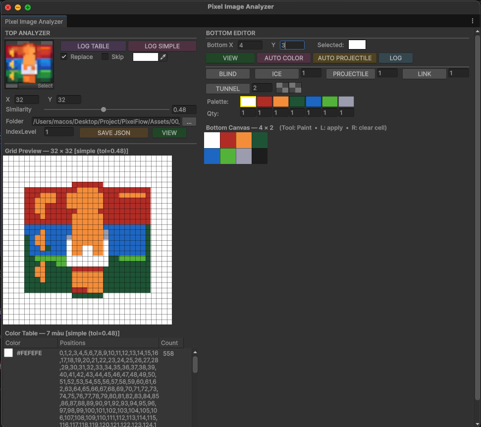

# Pixel Flow

> **Disclaimer:** This project was created for **educational and learning purposes only**. It is not intended for commercial use. All assets and resources used in this project belong to their respective owners.

---

## 🏠 Lobby

https://github.com/user-attachments/assets/eb0515af-b10b-4e60-a090-5bc94bffad26

---

## 🎮 Gameplay

### Pig Normal + Booster 3

https://github.com/user-attachments/assets/a5c708f7-1aa2-4536-919c-fee341f61770

### Pig Blind + Booster 1 & 2

https://github.com/user-attachments/assets/5c1d23b1-87f6-42e3-922d-27feba4c2bf8

### Tunnel

https://github.com/user-attachments/assets/6a462a48-026a-4ed3-8207-4440a2edcb84

### Link

https://github.com/user-attachments/assets/149adcca-1a37-427c-9a54-106b2f30ba16

### Ice

https://github.com/user-attachments/assets/cef09366-6b05-4698-9443-83a763398133

---

## 🛠 Level Editor Tool

A support tool for building levels — converts level layouts into JSON.

